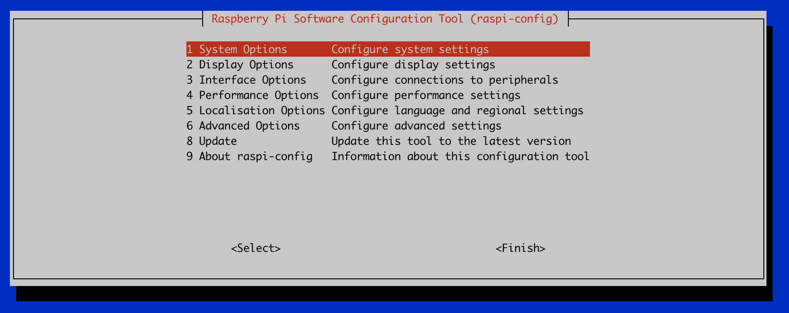
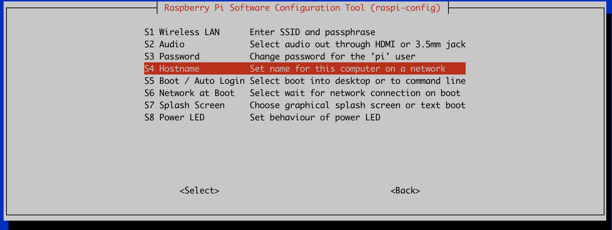
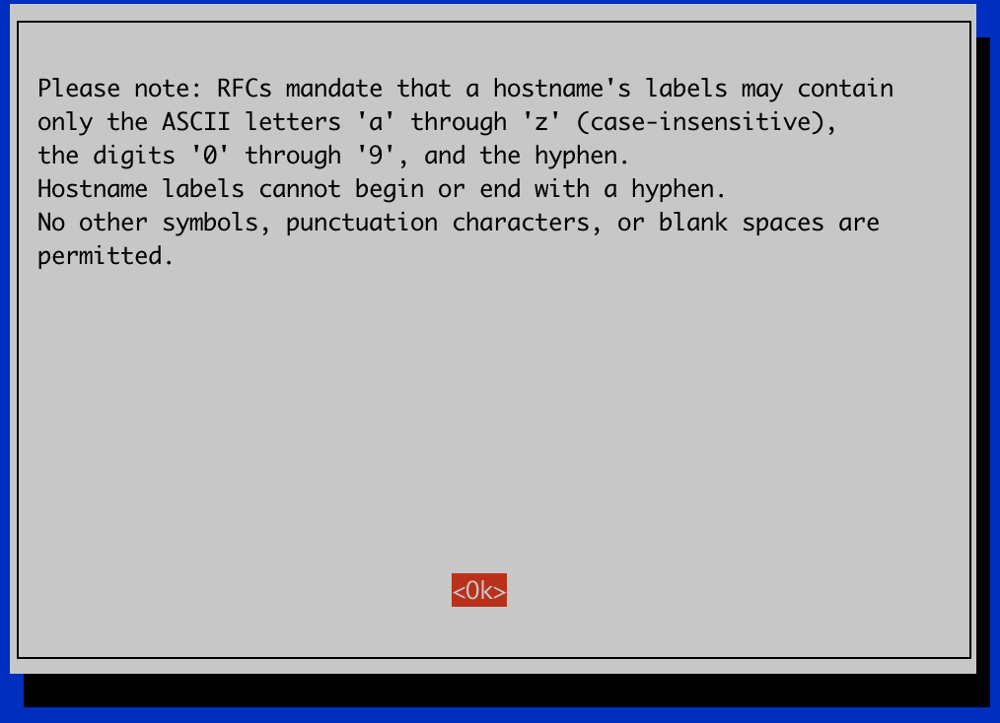
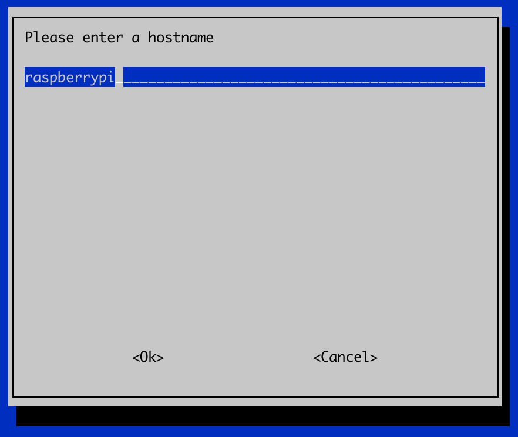

# Chang hostname of Rasberry Pi
When connecting to a rasberry pi for the first time, it will have the default hostname of "`raspberrypi`". 
This is great and all, but what happens when you start adding more pis to your collection? Changing the hostname is one of the first things I do when setting up a raspberry pi, so here's the process if you'd like to do the same.

## SSH to Raspberry Pi
I'm going to assume you have already SSH to the raspberry pi as described [here](../ssh-to-pi).

## Two ways to update the hostname
There are two ways to update the hostname on your rapsberry pi. The first one is by using the command prompt. This is a much easier way to just follow the prompted options and continue. Otherwise, you can modify the files directly, if you're more comfortable going that route.

Choose the method that you'd like:

[Update hostname via raspi-config prompt](#Update-hostname-via-raspi-config-prompt)

[Update by modifying etc/host files](#Update-by-modifying-etc/host-files)


## Update hostname via raspi-config prompt
To access the configuration files, you can type the following command
```
sudo raspi-config
```
This will open the configuration setup prompt.
<p align="center">
  
</p>

Here you can choose System Options by pressing enter.
<p align="center">
  
</p>

Here you obviously want to change the hostname, so you can press the down arrow to select hostname once highlighted.

<p align="center">
  
</p>
You can just continue by pressing enter.

<p align="center">
  
</p>

Here is where you can edit your hostname. Once finished press Ok to continue.

<p align="center">
  
</p>

It will ask if you'd like to reboot now. The new hostname will only take effect once the pi has been rebooted. So select `Yes` to continue.

This will then disconnect your SSH connection from the pi while it is rebooting. 

```
Connection to 192.168.1.100 closed by remote host.
Connection to 192.168.1.100 closed.
```

Once the pi has rebooted, the next time you connect to it via SSH you will see the new hostname.

## Update by modifying etc/host files
TODO