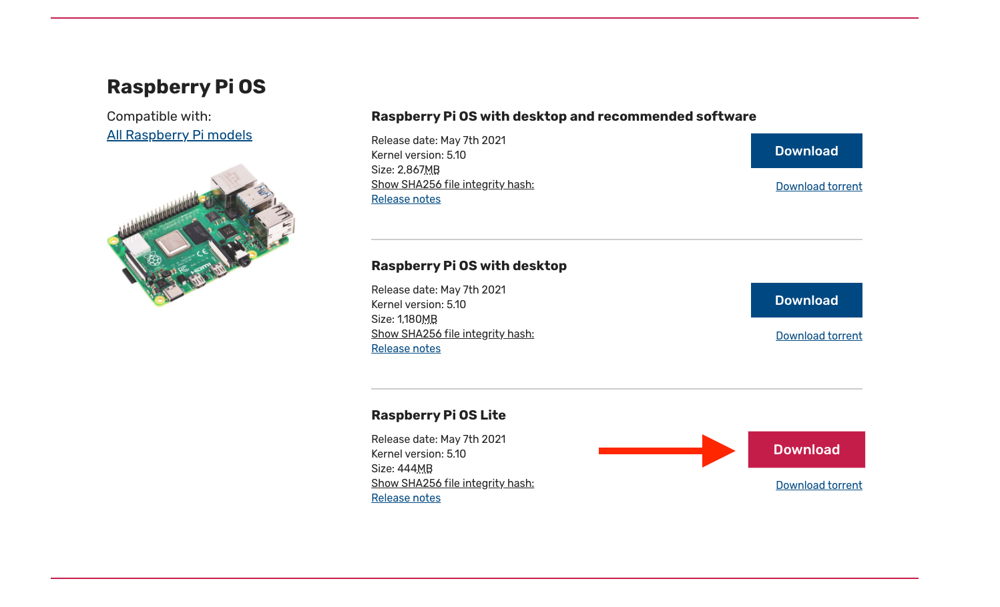

# Loading an operating system on SD Card from the terminal

## 1. Download the image that you want to load onto the SD card
If you want to download an image of Raspberry Pi OS, you can download it from the official raspberry pi website.

https://www.raspberrypi.org/software/operating-systems/

From here you can choose the version that you want to download. I am looking for the headless mode since I know I will connect only via SSH, so I only need Raspberry Pi OS Lite. Alternatively, if you know you will be using an interface, you can select one of the "with desktop" versions and follow the same process.

<p align="center">
  
</p>


This will most likely download the .img file to your `/Downloads` folder as a zip file called `2021-05-07-raspios-buster-armhf-lite.zip`.

Unzip the image with the unzip command. This will place the `.img` file wherever you launch this command from.

```
unzip ~/Downloads/2021-05-07-raspios-buster-armhf-lite.zip
```


## 2. Connect SD card to computer
Does that even count as a step?

## 3. Find disk device in the terminal
We need to have the list of disk devices available. Running the following command will show this list
```
diskutil list
```

The result should display something like this
```
/dev/disk0 (internal, physical):
   #:                       TYPE NAME                    SIZE       IDENTIFIER
   0:      GUID_partition_scheme                        *500.3 GB   disk0
   1:                        EFI EFI                     314.6 MB   disk0s1
   2:                 Apple_APFS Container disk1         500.0 GB   disk0s2

/dev/disk1 (synthesized):
   #:                       TYPE NAME                    SIZE       IDENTIFIER
   0:      APFS Container Scheme -                      +500.0 GB   disk1
                                 Physical Store disk0s2
   1:                APFS Volume Macintosh HD            15.3 GB    disk1s1
   2:                APFS Volume Macintosh HD - Data     64.4 GB    disk1s2
   3:                APFS Volume Preboot                 584.3 MB   disk1s3
   4:                APFS Volume Recovery                626.2 MB   disk1s4
   5:                APFS Volume VM                      3.2 GB     disk1s5

/dev/disk2 (external, physical):
   #:                       TYPE NAME                    SIZE       IDENTIFIER
   0:     FDisk_partition_scheme                        *32.0 GB    disk1
   1:             Windows_FAT_32 boot                    268.4 MB   disk1s1
   2:                      Linux                         1.6 GB     disk1s2
                    (free space)                         30.1 GB    -
```

I see that `/dev/disk0` is `(internal, physical)` and `500 GB`, which corresponds to my internal hard drive.

I see that `/dev/disk1` is `(synthesized)` and `500 GB`, which corresponds to the partitions of my internal hard drive.

I see that `/dev/disk2` is `(external, physical)` and `32 GB`, which corresponds to my SD card.

This means the device I want to use is the external 32GB at `/dev/disk2`.

## 4. Umount the SD card

Since I know I'm working with disk2, I will now need to unmount this disk
```
diskutil unmoutDisk /dev/disk2
```

It should then show a success message

```
Unmount of all volumes on disk2 was successful
```


## 5. Copy img file to SD card

```
pv 2021-05-07-raspios-buster-armhf-lite.img | sudo dd bs=1m of=/dev/rdisk2
```

Let's break this command down.

The `pv` command (Pipe Viewer) is used to monitor data being transferred.

The `dd` command is used to do the copying.

The `bs=1m` is specifying that we want a block size of 1 MB

The `of=/dev/rdisk2` is the location where we want to copy the file to.

When launching this command you should start to see a progress bar of the copy taking place.


```
 1.05GiB 0:01:13 [15.1MiB/s] [===========================================>                            ] 60% ETA 0:00:48
```

Once its finished copying you should see the final results.

```
1.75GiB 0:02:01 [14.8MiB/s] [========================================================================>] 100%
0+28608 records in
0+28608 records out
1874853888 bytes transferred in 117.232097 secs (15992667 bytes/sec)
```

## Bonus: Enable SSH on Raspberry Pi
In order to connect to your pi via SSH, you'll simply need to create a file called ssh inside your `/boot` folder.

```
touch /Volumes/boot/ssh
```

## Unmount disk and remove SD card from computer
Launch the same command as step 4 to unmount the disk one last time. 
```
diskutil unmoutDisk /dev/disk2
```
Now you can safely remove the SD card from your computer.

# Thats's it! You now have your OS loaded on your SD card, no interface needed!